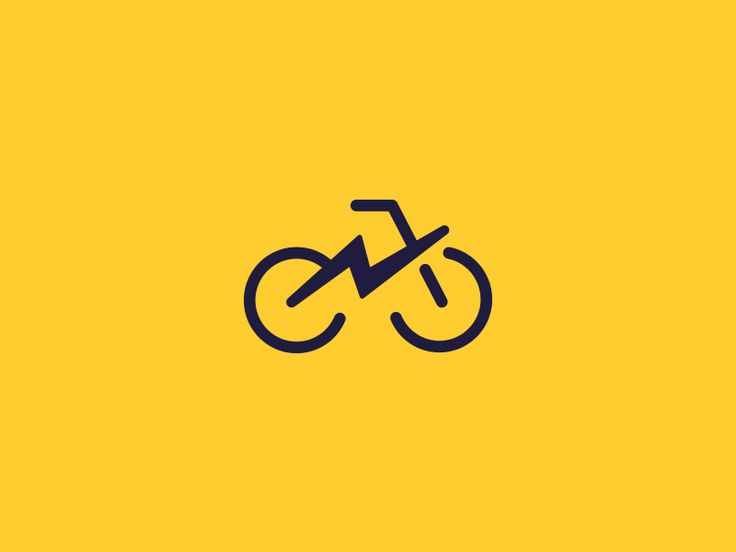

<!-- PROJECT LOGO -->
 

  

<h3 align="center">BikeoMeter</h3>
A website with a map, where you can view your location, where you can see your speed, burned calories and Average Speed, you can download to your phone as a Progressive Web Application (PWA).
